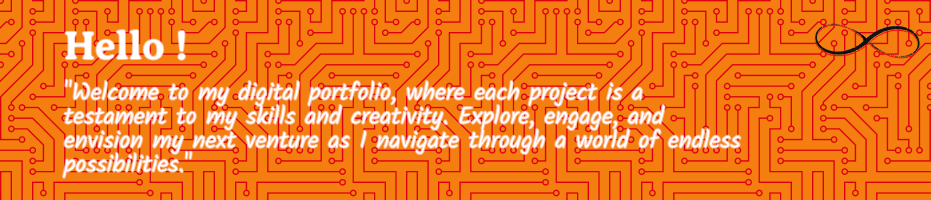

###

<h2 align="left">Greetings👋!</h2>

<h3 align="left">About Me...</h3>
  
"I am currently enriching my understanding in "B.Sc CS" through rigorous academic pursuits, with a strong interest in networking and cybersecurity. I am fascinated by the complexities of network architecture and the critical role of cybersecurity in protecting digital systems. I enjoy staying updated on the latest technological advancements and aspire to contribute to developing secure and efficient systems that positively influence the digital landscape."
 

###
<h3 align="left"><b>My Skills ...</h3> 

  
  
  
  
  
  
  
  
  
  
  
  
  
  
  
  
  
  
  
  
  
  
  
  
  

 

<h3 align="left">Portfolio...</h3> 

  
  
  

 

###

 

###

<h3 align="left">Contact Me...</h3>

###

